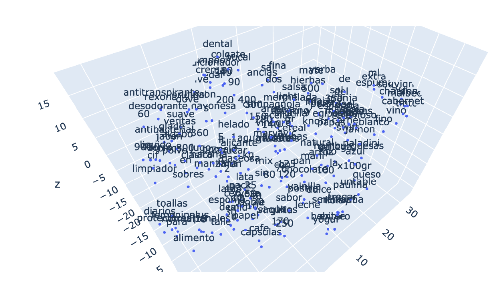
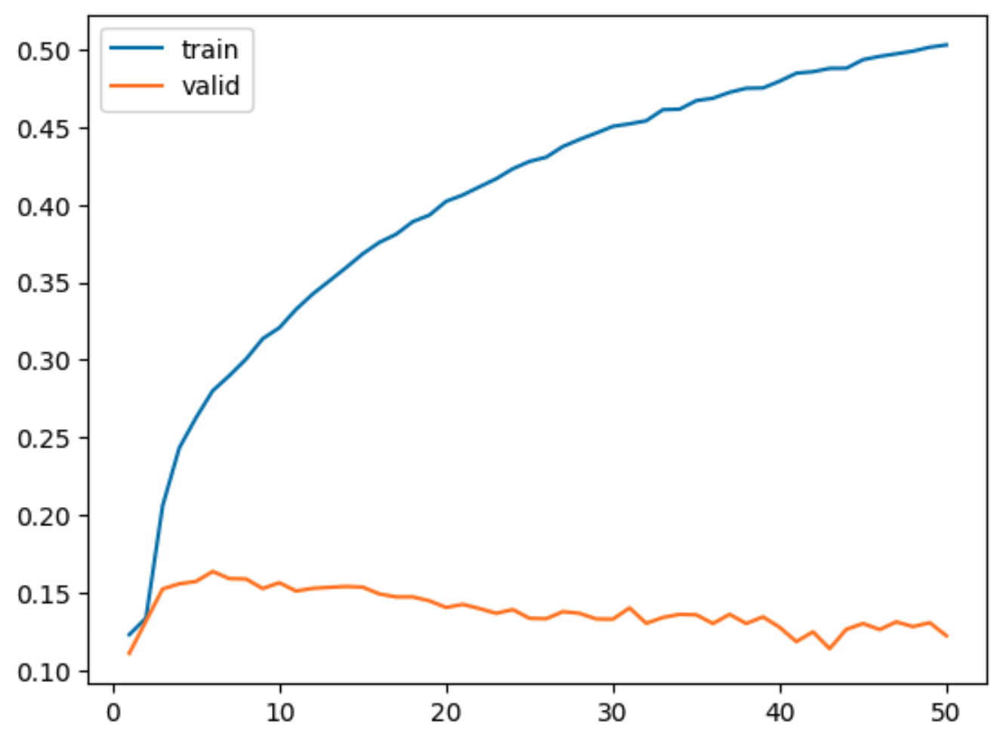
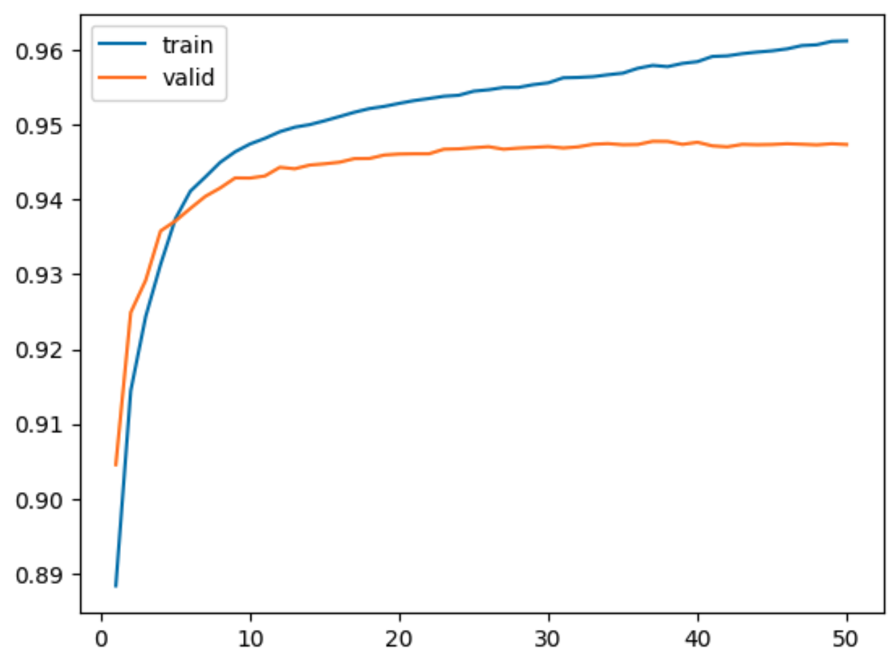

# Procesamiento del Lenguaje Natural - Desafíos de la Facultad

Este repositorio contiene una serie de desafíos realizados como parte de la materia de Procesamiento del Lenguaje Natural. Cada desafío aborda distintos temas y técnicas en el campo del PLN, explorando desde la vectorización hasta la creación de modelos avanzados para análisis y generación de texto.

## Desafíos

### [Desafío 1](https://github.com/jmbeitia/nlp/blob/main/1a%20-%20vectorizacion.ipynb): Vectorización
En este desafío, se aborda la vectorización de texto utilizando diferentes técnicas como one-hot encoding, vectores de frecuencia y cálculo de TF-IDF. Se comparan documentos para comprender su similitud.

### [Desafío 2](https://github.com/jmbeitia/nlp/blob/main/2c%20-%20bot_tfidf_nltk.ipynb): Sistema de Obtención de Información con NLTK
Utilizando un corpus del supermercado La Gallega, se emplea NLTK para consumir y procesar datos scrapeados del supermercado. Se realiza limpieza y procesamiento del dataset, aplicando vectores TF-IDF y similitud coseno al corpus.

### [Desafío 3](https://github.com/jmbeitia/nlp/blob/main/3b%20-%20Custom%20embedding%20con%20Gensim.ipynb): Custom Embeddings con Gensim
El objetivo aquí es crear embeddings de palabras personalizados utilizando Gensim. Se utilizan productos de supermercado para generar embeddings basados en su contexto de descripción. Se realiza preprocesamiento, entrenamiento de embeddings y visualización de agrupaciones de vectores.

<!--  -->

### [Desafío 4](https://github.com/jmbeitia/nlp/blob/main/4d%20-%20predicci%C3%B3n_palabra.ipynb): Predicción de Próxima Palabra con Embeddings de Keras y LSTM
Utilizando el mismo dataset del supermercado, se crea un modelo para predecir la próxima posible palabra. Se emplean embeddings con la capa Embedding de Keras junto con capas LSTM. Se generan secuencias nuevas y se aplica Beam Search y muestreo aleatorio.

<!--  -->

### [Desafío 5](https://github.com/jmbeitia/nlp/blob/main/5%20-%20clothing_ecommerce_reviews.ipynb): Análisis de Sentimientos con Embeddings + LSTM
Se utiliza un dataset de críticas de compradores de ropa para realizar análisis de sentimientos. Se limpian y balancean los datos, se entrena un modelo con Embeddings + LSTM para determinar la evaluación del comprador basada en las críticas.

### [Desafío 6](https://github.com/jmbeitia/nlp/blob/main/6%20-%20bot_qa.ipynb): LSTM Bot QA
Se emplean datos del challenge ConvAI2 para crear un BOT capaz de responder preguntas del usuario (QA) en conversaciones en inglés. Se realiza preprocesamiento, se preparan embeddings, se crea y entrena el modelo para la inferencia.

<!--  -->

## Referencias y Conjuntos de Datos
- [Dataset de Supermercado](https://github.com/jmbeitia/nlp/blob/main/datosLaGallega.json)
- [Dataset de Críticas de Ropa en Kaggle](https://www.kaggle.com/nicapotato/womens-ecommerce-clothing-reviews/version/1)
- [Datos del Challenge ConvAI2](http://convai.io/data/)

Cada carpeta de desafío contiene documentación detallada y código correspondiente a la resolución del desafío en particular.

¡Siéntete libre de explorar, contribuir o utilizar este repositorio para aprender y trabajar en el campo del Procesamiento del Lenguaje Natural!